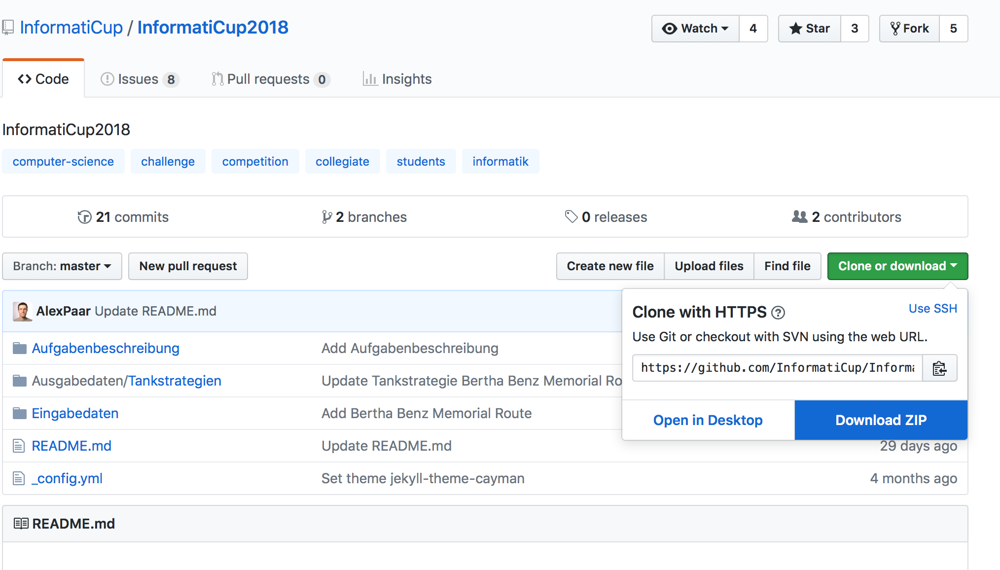

## FAQ

- I have not been able to clone the [InformatiCup2018](https://github.com/InformatiCup/InformatiCup2018) project into the `InformtatiCup2018` folder. What do I do now?
    - You can also download the InformatiCup2018 project by downloading it az a zip file and extracting it into the `InformtatiCup2018` folder. Just navigate to the GitHub page of InformatiCup2018 and click on `Clone or download` button in the upper right. Click on "Download ZIP" and extract the zip file into the `InformtatiCup2018` folder.
- I just executed `benzlim` but it seems like it is not responding. What is the problem? Should I wait or is there something wrong?
    - When you first run `benzlim` it will take some time until the data has been trained for future use. It could take more time on some specific hardware.
- Can I use `benzlim` to predict fuel prices from all over the world?
	- `benzlim`  was originally created for gas stations located in Germany. It is possible to use `benzlim` for any other data set. To do so, just use the same file and folder schema of the `InformtatiCup2018` folder (cloned from [InformatiCup2018](https://github.com/InformatiCup/InformatiCup2018)) and add your preferred data set as historic data for predictions. After that, you just need to train the model with the command `python benzlim train --force` once and you are ready to go.