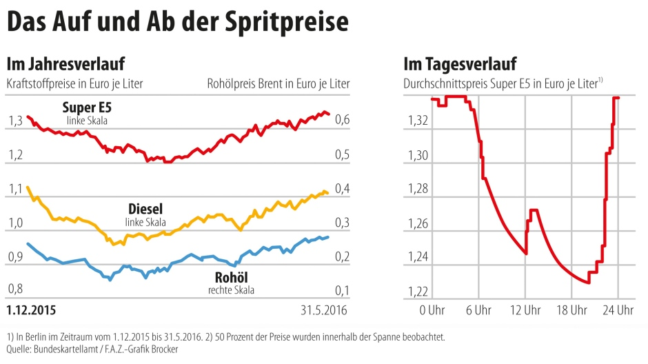
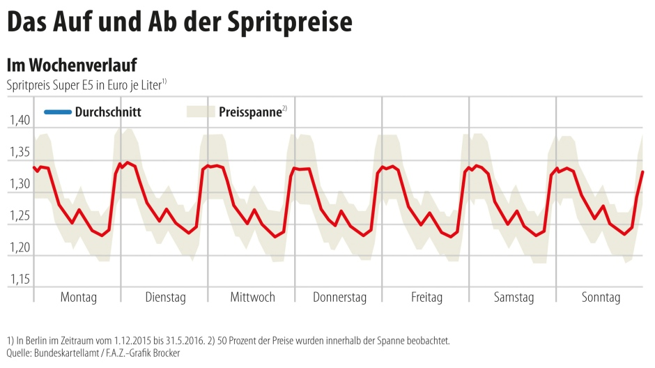
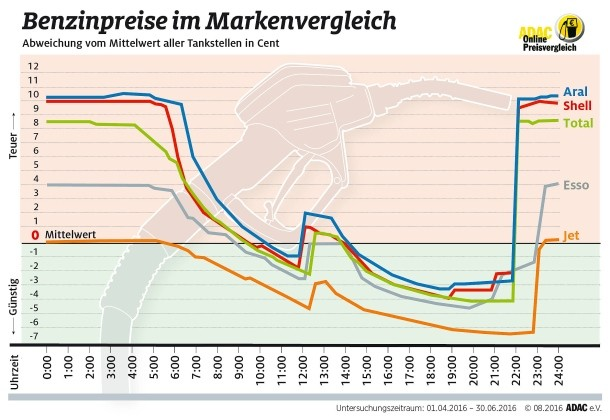
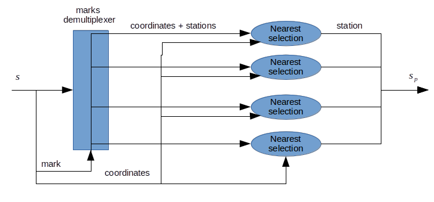
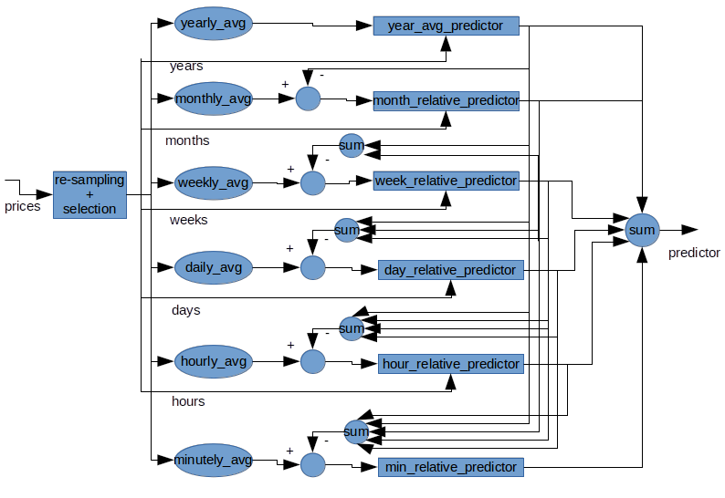

InformatiCup 2018 - Benzlim
------------------------------------------------------------

**Franck Awounang Nekdem**,  **Gerald Wiese**,  **Amin Akbariazirani** und **Lea Evers**

[TOC]

## Einführung

Die Tankstrategie ist ein wichtiger Bestandteil jeder Reise. Wann, an welcher Tankstelle und wie viel Tanken zu müssen um am günstigsten und effizientesten ans Ziel zu gelangen macht auf lange Sicht einen großen finanziellen Unterschied.
Benzlim ist eine Python basierte Software Lösung die Verbraucher und Entwickler nutzen können, um Benzinpreise vorherzusagen und den Effizientesten Tankstrategie zu erstellen.

## Analyse

* **Benzinpreisentwicklung**

* **Benzinpreisunterschiede**

  Der entscheidende Faktor für den Preisunterschiede der verschiedenen Tankstellen ist die Marke.

 

Bild 1. *Quelle:* [Frankfurt Allgemeine Zeitung][faz_preis_zyklen] 

Bild 2. *Quelle:* [Frankfurt Allgemeine Zeitung][faz_preis_zyklen]

Bild 3. *Quelle:* [Frankfurt Allgemeine Zeitung][adac_tankstellen_vergleich]

Benzinpreisänderungen am Tag sind unabhängig von der Marke

[blabla]: demo
[hello]: https://www.focus.de/auto/praxistipps/benzinpreise-guenstig-tanken-zur-richtigen-zeit-am-richtigen-ort_id_4902163.html

## Ansatz

Die ausgewählte Lösungsweg basiert darauf, dass Benzinpreise zwar sehr flüchtig sind, dennoch ihre Preise hängen stärker von der Marke als von dem Ort an.
Um die Preise vorhersagen zu können werden die durchschnittlichen Benzinpreise in bestimmten Zeitspannen (Jährlich, Monatlich, Wöchentlich, Täglich, Stündlich, Minütlich) berechnet. Die erzeugten Daten werden zu einem Extrapolator übergeben, der einen Prädiktor für die Differenz zwischen der jeweiligen Zeiteinheit und die höheren Zeiteinheiten erzeugt. Der grundlegende Prädiktor summiert die durchschnittlichen jährlichen Prädiktionen mit die monatlichen, wöchentlichen, täglichen, stündlichen und minütlichen Prädiktionen auf und erzeugt die Vorhersage.

### Training

Für die weitere Verarbeitung werden die Daten gereinigt und optimal gespeichert. Um auf die Daten optimal zugreifen zu können, werden in der Trainingsphase die folgenden Schritte durchgeführt: 
1. Eine lokale Datenbank mit Stationinformationen wird erzeugt
2. Die Stationinformationen werden um die Verfügbarkeit der Preise, sowie das Datum des ersten gemeldeten Preises erweitert.

### Vorhersage

#### Klassifizierung

Seien *S* die Menge aller bekannten Stationen und *S_p* die Menge aller Stationen mit Preisinformationen.
#### Klassifizierung

"S" ist die Menge aller bekannten Stationen und "Sp" ist die Menge aller Stationen sowie die dazugehörigen Preisinformationen.
Die Klassifizierung gibt für eine Station "s" in "S" die passendste Station "sp" in "Sp" aus.

​		Bild 4.

#### Vorhersage

##### Prädiktionen

Pro Vorhersage wird ein Prädiktor *P* trainiert.

* Es werden Preise selektiert, die in dem gleichen Stundenzeitlot sind, wie der Zeitstempel für die Prädiktion
* Der Prädiktor besteht aus 6 Subprädiktoren
* Seien *yearly_avg*,  *monthly_avg*, *weekly_avg*, *daily_avg*, *hourly_avg* und *min_avg* jeweils die  jährlichen, monalichen, wochentlichen, täglichen und stündlichen durchschnittlichen Preise. 
* Seien *monthly_rel*, *weekly_rel*, *daily_rel*, *hourly_rel* und *min_rel* Unterschied zwischen jeweils den monalichen, wochentlichen, täglichen und stündlichen durchschnittlichen Preisen und den durchschnittlichen Preisen der höheren Zeiteinheit.
* *yearly_avg* wird zu einem Extrapolator übergeben, der ein Prädiktor für ein für den jährlichen durchschnittlichen Preis erzeugt. Jede **_rel*  Tabelle berechnet sich aus die Unterschiede zwischen dem passenden **_avg* und die Summe der Prädiktionen der höheren Zeiteinheiten.
* Alle **_rel* werden zu einem Extrapolator übergeben, der ein Prädiktor für den Unterschied zwischen der jeweiligen Zeiteinheit und die höheren erzeugt.
* Der grundlegende Prädiktor summiert die durchschnittlichen jährliche Prädiktion und relative monatliche, wöchentliche, tägliche, stündliche und minütliche Prädiktion.
* Es wird der Durchschnitt der selektierten Preisen für die Vorhersage berechnet. Dieser wird als prädizierter Wert benutzt, falls den tatsächlichen prädizierten Wert eine Abweichung von 20% zu ihm weist. Somit ist der prädizierte Preis *pp1* vom Prädiktor *P1* erzeugt.
* Als Zusatz wird *untrust = std(prices) / mean(selected_prices)* wo *std* die Standardabweichung ist und *avg* die Durchschnittfunktion. *untrust* gibt die Unsicherheit des Prädiktors an.

* Es werden Preise ausgewählt, die in dem gleichen Stundenzeitslot sind, wie der Zeitstempel für die Vorhersage.
* "yearly_avg", "monthly_avg", "weekly_avg", "daily_avg", "hourly_avg" und "min_avg" sind jeweils die jährlichen, monatlichen, wöchentlichen, täglichen und stündlichen durchschnittlichen Preise.
* "monthly_rel", "weekly_rel", "daily_rel", "hourly_rel" und "min_rel" sind die Differenz zwischen jeweils den durchschnittlichen monatlichen, wöchentlichen, täglichen und stündlichen Preisen und den durchschnittlichen Preisen der höheren Zeiteinheit.
* "yearly_avg" wird zu einem Extrapolator übergeben, der ein Prädiktor für den jährlichen Durchschnittspreis erzeugt. Jede "_rel" Tabelle wird durch die Berechnung der Differenz zwischen dem passenden "_avg" und die Summe der Prädiktionen der höheren Zeiteinheiten erzeugt.
* Alle "_rel" werden zu einem Extrapolator übergeben, der einen Prädiktor für die Differenz zwischen der jeweiligen Zeiteinheit und die höheren Zeiteinheiten erzeugt.
* Der grundlegende Prädiktor summiert die durchschnittlichen jährlichen Prädiktionen mit die monatlichen, wöchentlichen, täglichen, stündlichen und minütlichen Prädiktion auf und erzeugt die Vorhersage.

Bild. 5

#### Korrektor

- Ein zweiter Prädiktor *P2* mit nur einem Level wird trainiert. Er präzidiert einen Preis basierend auf die Anzahl der Nanosekunden in einem Zeitsstempel. Dieser Prädiktor verfügt eben über Autokorrektur und generiert zusätzlich zu dem prädizierten Preis *pp2* eine Unsicherheit *untrust2* , die ausgibt wie  unsicher der Prädiktor ist.
- Seien *trust1 = 1-untrust1* und *trust2 = 1 - untrust2*. Der endgültigte prädizierte Preis ist :  *pp= (trust1*pp1 + trust2*pp2) / (trust1 + trust2)*

### Routing

Basierend auf die Entfernung bis zur nächsten günstigsten Tankstelle und die Tankkapazität des Autos, wird die richtige Strecke und der zu tankende Menge, berechnet.

## Ergebnisse

## Auswertung

Bei der Auswertung liegt der Fokus auf die vorhersage der Preise.
Ausgewertet sind sowohl Stationen mit verfügbaren Preisinformationen als auch Stationen die keine Daten zu deren Preisen zur Verfügung gestellt haben.

#### Vorhersage

Ausgewertet werden Prädiktionen bei denen das Training mit tatsächlichen Preisen der Station durchgeführt wurde und anschließend Prädiktionen bei denen das Training mit Preisen einer Ersatzstation durchgeführt wurde.
* Vorhersagen mit verfügbaren Preisen

  Wir haben 1000 Stationen mit verfügbaren Preisinformationen ausgewählt und für jede dieser Stationen einen Zufallsdatum erzeugt.
  Mit der o. g. Informationen wurden 16 Vorhersagen mit jeweils unterschiedlichen Enddaten für das Training durchgeführt. Für jede Station wurden die maximalen und durchschnittlichen absoluten Fehler sowie die relativen durchschnittlichen Fehler gemessen.

  Wir haben 1000 Stationen mit Preisen ausgewählt und für jede Station ein Datum ausgewählt, aus dem 16 Mal vorhergesagt wurde, mit unterschiedlichen Enddaten fürs Training. Für jede Station wurde den  maximalen und durchschnittlichen absoluten Fehler sowie den relativen durchschnittlichen Fehler berechnet.

* Vorhersage ohne verfügbare Preise

  Wir haben 1000 Stationen mit Preise ausgewählt und für jede Station ein Prädiktor mit einer alternativen Station vom Klassifier gegeben trainiert und 16 Mal Preise Vorhergesagt. Die Preise der originalen Station wurden benutzt als Referenzwerte für die Berechnung der Fehler. Für jede Station wurde den  maximalen und durchschnittlichen absoluten Fehler sowie den relativen durchschnittlichen Fehler berechnet.
* Vorhersagen ohne verfügbare Preise

  Wir haben 1000 Stationen mit verfügbaren Preisinformationen ausgewählt und für jede dieser Stationen einen Prädiktor mit einer alternativen Station vom Klassifier ausgesucht.
  Mit der o. g. Informationen wurden 16 Vorhersagen durchgeführt. Diesbezüglich wurden die Preise der originalen Stationen als Bezugswert für die Berechnung der Fehler benutzt. Für jede Station wurden die maximalen und durchschnittlichen absoluten Fehler sowie die relativen durchschnittlichen Fehler gemessen.

Der Benchmark wurde mit folgender Anweisung ausgeführt:

`python benzlim benchmark --nb_stations 1000 --nb_predictions 16`

Durch die Ausführung der o. g. Anweisung werden die zwei Dateien `benchmark_with_prices.csv` und `benchmark_without_prices.csv` in `benzlim\out\` gespeichert.

Ein Abschnit aus den Ergebnissen ist in folgenden Tabellen gelistet, wo  *e* der Unterschied zwischen einen prädizierten Preis *pp* und den Referenzpreis *pr* ist.
Ein Abschnitt aus den Ergebnissen ist in der folgenden Tabelle aufgelistet. Hier ist "e" die Differenz zwischen der vorhergesagten Preisen "pp" und der Referenzpreis "pr".

* **Vorhersagen mit verfügbaren Preisen**

| station_id       | 6421  | 14554  | 6799   | 5049   | 10823  | 79     | 3607   | 12682  | 2885   |
| ---------------- | ----- | ------ | ------ | ------ | ------ | ------ | ------ | ------ | ------ |
| *max(abs(e))*     | 62    | 26     | 42     | 42     | 69     | 98     | 39     | 29     | 27     |
| *avg(abs(e))*     | 30    | 18     | 29     | 15     | 34     | 27     | 24     | 20     | 20     |
| *avg(abs(e)/pr)* | 0.023 | 0.0135 | 0.0202 | 0.0108 | 0.0237 | 0.0217 | 0.0191 | 0.0151 | 0.0161 |

Tabelle 1.

* **Vorhersagen ohne verfügbare Preise**

| base_station_id  | 2953   | 7655   | 58     | 30     | 0.0209 | 14018  | 15133 | 71     | 33     |
| :--------------- | ------ | ------ | ------ | ------ | ------ | ------ | ----- | ------ | ------ |
| used_station_id  | 7655   | 15133  | 13424  | 4      | 15164  | 14459  | 14184 | 14716  | 14184  |
| *max(abs(e))*     | 58     | 71     | 46     | 72     | 60     | 39     | 43    | 37     | 45     |
| *avg(abs(e))*     | 30     | 33     | 19     | 40     | 53     | 12     | 16    | 16     | 24     |
| *avg(abs(e)/pr)* | 0.0209 | 0.0238 | 0.0144 | 0.0303 | 0.0325 | 0.0082 | 0.012 | 0.0124 | 0.0178 |

Im Durchschnitt haben Preisvorhersagen für sowohl Stationen mit Preisinformationen als auch Stationen ohne Preisinformationen eine absolute Fehlerrate von 25 bis 40.

Im Durchschnitt hatten Vorhersagen mit und ohne Preisen einen absoluten Fehler von **33 +/- 6** und einen relativen Fehler von **0.022 +/- 0,004** . Absolute Fehler der Vorhersagen ohne Preise bewegen sich im selben Intervall.

#### Bekannte Probleme

* Der Speicherverbrauch ist proportional zur Anzahl der Prozessorkerne und kann beim Benchmarking zu Problemen führen
* Die Tankstrategie ist in ca. 5% der Fälle Inkonsistent
* "Multiprocessing" führt unter Windows zu Fehlern. Dementsprechend wird für Windows nur "Monoprocessing" verwendet

## Abschluss

### Ausblick

- Die Anwendung von einem erweitertem Weg zur Berechnung der Unsicherheit könnte die Ergebnisse verbessern. Er könnte zum Beispiel  auf den Prädiktionfehler von den Werten die für das Training benutzt wurden.
- Die Tankstrategie benutzt zurzeit eine fixe Unsicherheit für alle Station/Anhaltspunkte. Es ist zu erwarten, dass sie mit genaueren Informationen bessere Schätzungen macht nämlich die Unsicherheit jedes einzeln prädizierten Preis. 
- Benzlim ist der Stützpunkt für viele weitere Projekte die ein Effizienteres Routing für Autofahrer erbringen können. Diese wären bessere Routingalgorithmen, Reiseplanung Software usw.

[adac_tankstellen_vergleich]: http://www.faz.net/aktuell/finanzen/meine-finanzen/geld-ausgeben/adac-tankstellenvergleich-shell-und-aral-am-teuersten-14404375.html	"Adac Tankstellengvergleich"  
[focus_guenstig_tanken]: https://www.focus.de/auto/praxistipps/benzinpreise-guenstig-tanken-zur-richtigen-zeit-am-richtigen-ort_id_4902163.html	"Benzinpreise, guenstig tanken"  
[faz_preis_zyklen]: http://www.faz.net/aktuell/finanzen/devisen-rohstoffe/beim-benzinpreis-bis-zu-30-cent-unterschied-am-tag-14869994.html	"Benzinpreis! Unterschiede am Tag"  
[mtsk_dritte_jahr]: http://www.bundeskartellamt.de/SharedDocs/Publikation/DE/Berichte/Dritter_Jahresbericht_MTS-K.pdf	" Das 3. Jahr Markttransparenzstelle"  
